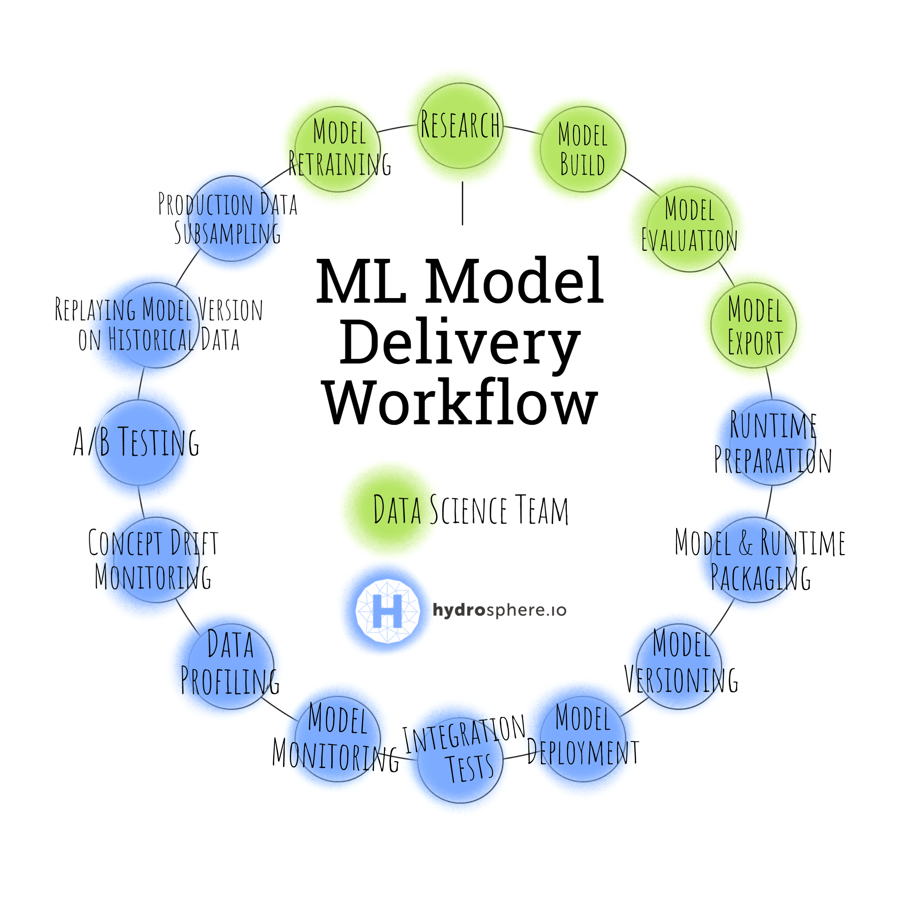

# Train and deliver machine learning models to production with a single command

Very often a workflow of training models and delivering them to the production environment contains loads of manual work. These could be various steps depending on the type of the model you're using and the workflow you're working within. 

The workflow can be divided into two main parts: data science and "devops". The first part contains all the work related to the model development and model evaluation. To name a few aspects:

- Subject area research
- Model building
- Model evaluation

These have already become fundamental across the field. But what about the "devops"-ish part of job? Can you name a few aspects related to the model delivery onto production? 

The most popular solutions I could've found there is building a Python web server (most commonly on Flask framework) and using it as a base for model inference. The model is typically uploaded via VSC/SSH or delivered as Python package. Sometimes there could be a NGINX server, round-robing each request across multiple Flask servers. If you have enough expertise you can pack the model into container and deploy it to the Kubernetes cluster (or just be content with running it within your Docker engine instance). 

Can you derive the steps that are needed to perform the described above? 

Well, let me try:

- Model export
- Runtime preparation
- Model & Runtime packaging
- Model versioning 
- Model deployment 
- Integration tests 
- Performing A/B tests between model versions
- Replaying predictions on the historical data
- Model monitoring
- Data monitoring 
- Historical data subsampling 
- Model retraining 

Hmm, I kind of went too far... But let me put this straight. This field is still in the development (https://twitter.com/AndrewYNg/status/1080887386488299520). From company to company the workflow changes, fluctuates by adding new aspects and removing the other ones. Describing each of the steps in the workflow may take us a whole new article(s) and I won't go that far now. 



But my point is - if you have to do this all manually, it can hardly be named "continuous delivery". Imagine, you could've deployed the model just by one command, hiding all of these intermediate steps. I can take this even further - you can configure a whole pipeline that will train => evaluate => deliver => test => infer the model onto production. 

## Prerequisites

In this section we will create a predefined infrastructure to work with. 
This tutorial assumes that you have an access to a Kubernetes cluster and [initialized Helm Tiller](https://docs.helm.sh/using_helm/#initialize-helm-and-install-tiller) on it. If you don't, you can create your own single node cluster locally with Minikube or Kubernetes for Docker. You will also need:

- [Docker](https://docs.docker.com/)
- [Helm](https://helm.sh/)
- [Kubectl](https://kubernetes.io/docs/tasks/tools/install-kubectl/#install-kubectl) 
- [Ksonnet](https://ksonnet.io/get-started/)

## Environment Preparation

Create a working directory where will be stored model's files. Initialize a ksonnet project inside that directory.

```sh
$ mkdir mnist; cd mnist
$ ks init demo; cd demo
```

Now you would need to deploy Kubeflow and Argo to the cluster. 
- Kubeflow is a Machine Learning toolkit for Kubernetes. We will use it for model training. 
- Argo is a collection of tools, which will let us write workflow pipelines to execute jobs on the Kubernetes cluster. 

```sh
$ ks registry add kubeflow github.com/kubeflow/kubeflow/tree/v0.2.5/kubeflow
$ ks pkg install kubeflow/core@v0.2.5
$ ks pkg install kubeflow/argo 
$ ks generate core kubeflow-core --name=kubeflow-core
$ ks generate argo kubeflow-argo --name=kubeflow-argo
$ ks apply default -c kubeflow-core
$ ks apply default -c kubeflow-argo

$ cd ..  # cd to the parent `mnist` directory where we'll be working
```

Once you've done that, deploy a ML Lambda serving platform. This is essentially a service that will manage and run your models. 

```sh
$ helm repo add hydro-serving https://hydrospheredata.github.io/hydro-serving-helm/
$ helm install --name serving hydro-serving/serving
```

We will additionally need a few resources on this cluster. PersistentVolumeClaims to store the data and trained models. 

```yaml
# pvc.yaml

apiVersion: v1
kind: PersistentVolumeClaim
metadata:
  name: data
spec:
  accessModes:
    - ReadWriteMany
  resources:
    requests:
      storage: 20Gi
---
apiVersion: v1
kind: PersistentVolumeClaim
metadata:
  name: models
spec:
  accessModes:
    - ReadWriteMany
  resources:
    requests:
      storage: 20Gi
```

```sh 
$ kubectl apply -f pvc.yaml
```

If RBAC is enabled on the cluster, we will need to additionally grant an access for training ops. Let's define `service-account.yaml` for it. 

```yaml
# service-account.yaml

apiVersion: rbac.authorization.k8s.io/v1
kind: Role
metadata:
  name: tf-user
rules:
- apiGroups: [""]
  resources: ["pods", "pods/exec", "services"]
  verbs: ["create", "get", "list", "watch", "update", "patch"]
- apiGroups: [""]
  resources: ["configmaps", "serviceaccounts", "secrets"]
  verbs: ["get", "watch", "list"]
- apiGroups: [""]
  resources: ["persistentvolumeclaims"]
  verbs: ["create", "delete"]
- apiGroups: ["apps", "extensions", "batch"]
  resources: ["deployments", "jobs"]
  verbs: ["create", "get", "list", "watch", "update", "patch", "delete"]
- apiGroups: ["argoproj.io"]
  resources: ["workflows"]
  verbs: ["get", "list", "watch", "update", "patch"]
- apiGroups: ["kubeflow.org"]
  resources: ["tfjobs", "jobs"]
  verbs: ["create", "get", "list", "watch", "update", "patch", "delete"]
---
apiVersion: rbac.authorization.k8s.io/v1
kind: RoleBinding
metadata:
  name: tf-user
roleRef:
  apiGroup: rbac.authorization.k8s.io
  kind: Role
  name: tf-user
subjects:
- kind: ServiceAccount
  name: tf-user
  namespace: default
---
apiVersion: v1
kind: ServiceAccount
metadata:
  name: tf-user
```

```sh
$ kubectl apply -f service-account.yaml
```

Next we will create a simple MNIST classifier. Let's assemble the data. 

## Data gathering

Create directory `image`. This directory will be the base for the working Docker image, responsible for training/exporting/testing steps.

```sh
$ mkdir image; cd image
```

MNIST dataset is located under the http://yann.lecun.com/exdb/mnist/ address in the binary format. We will download the data, process it into a numpy array and store under the mounted path. 

```python
# domnload-mnist.py

from PIL import Image
import struct, numpy
import os, gzip, tarfile, shutil, glob
import urllib, urllib.parse, urllib.request


def download_files(base_url, base_dir, files):
    """ Download required data """

    downloaded = []
    os.makedirs(base_dir, exist_ok=True)

    for file in files:
        print(f"Started downloading {file}", flush=True)
        download_url = urllib.parse.urljoin(base_url, file)
        download_path = os.path.join(base_dir, file)
        local_file, _ = urllib.request.urlretrieve(download_url, download_path)
        unpack_file(local_file, base_dir)
    
    return downloaded


def unpack_file(file, base_dir):
    """ Unpack the compressed file. """

    print(f"Unpacking {file}", flush=True)
    with gzip.open(file, 'rb') as f_in, open(file[:-3],'wb') as f_out:
        shutil.copyfileobj(f_in, f_out)
    os.remove(file)


def preprocess_mnist_files(path, dataset):
    """ Preprocess downloaded MNIST datasets. """
    
    print(f"Preprocessing {os.path.join(path, dataset)}", flush=True)
    label_file = os.path.join(path, dataset + '-labels-idx1-ubyte')
    with open(label_file, 'rb') as file:
        _, num = struct.unpack(">II", file.read(8))
        labels = numpy.fromfile(file, dtype=numpy.int8) #int8
        new_labels = numpy.zeros((num, 10))
        new_labels[numpy.arange(num), labels] = 1

    img_file = os.path.join(path, dataset + '-images-idx3-ubyte')
    with open(img_file, 'rb') as file:
        _, num, rows, cols = struct.unpack(">IIII", file.read(16))
        imgs = numpy.fromfile(file, dtype=numpy.uint8).reshape(num, rows, cols) #uint8
        imgs = imgs.astype(numpy.float32) / 255.0

    os.remove(label_file); os.remove(img_file)
    numpy.savez_compressed(os.path.join(path, dataset), imgs=imgs, labels=labels)


if __name__ == "__main__": 
    mnist_dir = os.environ.get("MNIST_DATA_DIR", "data/mnist")
    mnist_files = [
        'train-images-idx3-ubyte.gz',
        'train-labels-idx1-ubyte.gz',
        't10k-images-idx3-ubyte.gz',
        't10k-labels-idx1-ubyte.gz']
    
    downloaded = download_files(
        base_url="http://yann.lecun.com/exdb/mnist/", 
        base_dir=mnist_dir, 
        files=mnist_files)
    preprocess_mnist_files(mnist_dir, "train")
    preprocess_mnist_files(mnist_dir, "t10k")    
```

As you can see files will be stored either in the directory defined by the `MNIST_DATA_DIR` environment variable, or locally under the `data/mnist` path if `MNIST_DATA_DIR` variable is unset. 

## Building classification model

For the model backend we will use a Tensorflow high-level Estimator API.

```python
# mnist-model.py

import os
import tensorflow as tf
import numpy as np

models_path = os.environ.get("MNIST_MODELS_DIR", "models/mnist")
models_path = os.path.join(models_path, "model")
base_path = os.environ.get("MNIST_DATA_DIR", "data/mnist")
train_file = "train.npz"
test_file = "t10k.npz"

learning_rate = os.environ.get("LEARNING_RATE", 0.01)
num_steps = os.environ.get("LEARNING_STEPS", 10000)
batch_size = os.environ.get("BATCH_SIZE", 256)


def input_fn(file):
    with np.load(os.path.join(base_path, file)) as data:
        imgs = data["imgs"]
        labels = data["labels"].astype(int)
    return tf.estimator.inputs.numpy_input_fn(
        x = {"imgs": imgs}, y=labels, shuffle=True)

if __name__ == "__main__":
    imgs = tf.feature_column.numeric_column("imgs", shape=(28,28))
    train_fn, test_fn = input_fn(train_file), input_fn(test_file)

    estimator = tf.estimator.DNNClassifier(
        hidden_units=[256, 64],
        feature_columns=[imgs],
        n_classes=10,
        optimizer=tf.train.AdamOptimizer(learning_rate=learning_rate))

    tf.logging.set_verbosity(tf.logging.INFO)
    train_spec = tf.estimator.TrainSpec(input_fn=train_fn, max_steps=num_steps)
    eval_spec = tf.estimator.EvalSpec(input_fn=test_fn)
    tf.estimator.train_and_evaluate(estimator, train_spec, eval_spec)

    serving_input_receiver_fn = tf.estimator.export.build_raw_serving_input_receiver_fn({
        "imgs": tf.placeholder(tf.float32, shape=(None, 28, 28))})
    estimator.export_savedmodel(models_path, serving_input_receiver_fn)
```

Here we define a function `input_fn` that will produce images for our DNN Classifier. The network itself consists of 2 fully-connected hidden layers with 256 and 64 units respectively. As an activation function we use the default ReLU activation. As an optimizer we chose Adam with the learning rate that is configurable from the outside (via environment variable). After the training the model is stored in `saved_model` format under the specified path. We store both the graph and the weights. 

## Preparing applications manifest

During the model upload ML Lambda packs the model into Docker image, assigns it with a version and uploads the serving instance. But in order to inference on that model you would have to deploy it via endpoint applications. There are two ways of doing that, but here we will do this with CLI. Create an `application.yaml`. 

```yaml
# application.yaml 

version: v2-alpha
kind: Application
name: mnist-concept-app
singular:
  model: mnist-concept:1
  runtime: hydrosphere/serving-runtime-tensorflow:1.7.0-latest
```

This will create an application, that will use the uploaded model version as a base. 

## Integration tests

After deployment step is done, we need to perform integration tests to ensure that the model runs properly. Create a `client.py` file, which will send a few images to the deployed model and perform evaluation.

```python
# client.py

import os, sys, time, json
import requests
import numpy as np
from sklearn.metrics import accuracy_score

host_address = os.environ.get("HOST_ADDRESS", "http://localhost")
application_name = os.environ.get("APPLICATION_NAME", "mnist-app")
signature_name = os.environ.get("SIGNATURE_NAME", "predict")
warmup_images_count = int(os.environ.get("WARMUP_IMAGES_AMOUNT", 100))

mnist_base_path = os.environ.get("MNIST_DATA_DIR", "data/mnist")
test_file = "t10k.npz"

# Import MNIST data
with np.load(os.path.join(mnist_base_path, test_file)) as data:
    imgs, labels = data["imgs"], data["labels"]
    imgs, labels = imgs[:warmup_images_count], labels[:warmup_images_count]
    clean_images = len(imgs)

noisy_imgs, noisy_labels = np.copy(imgs), np.copy(labels)
noisy_imgs, noisy_labels = noisy_imgs[:warmup_images_count//2], noisy_labels[:warmup_images_count//2]
noise = np.random.uniform(size=noisy_imgs.shape)

data = np.concatenate((imgs, noisy_imgs+noise))
labels = np.concatenate((labels, noisy_labels))

link = f"{host_address}/gateway/applications/{application_name}/{signature_name}"
print(f"Using URL :: {link}", flush=True)

# Perform Predictions
predicted = []
for index, image in enumerate(data):
    try:
        image = [image.tolist()]
        response = requests.post(url=link, json={'imgs': image})
        print(f"{index+1}/{len(data)} :: predicted class " /
              f"{response.json()['class_ids'][0][0]}", flush=True)
        predicted.append(response.json()["class_ids"][0][0])
    except Exception as e:
        predicted.append(-1)
        print(e, flush=True)
        time.sleep(5)
    time.sleep(0.6)

print(accuracy_score(labels[:clean_images], predicted[:clean_images]), flush=True)
```

This will print all evaluation statistics in the pod logs. 

## Packing image

The next step will be building the Docker image. As a base image we will use `python:3.6-slim` image. Since this would be a raw Python container, we would also need to install a few python packages inside it. Create a `requirements.txt` file. 

```
numpy==1.14.3
Pillow==5.2.0
tensorflow==1.9.0
hs==0.1.3
scikit-learn==0.20.0
```

Now we can create a `Dockerfile`.

```Dockerfile
FROM python:3.6-slim
ADD ./requirements.txt /src/requirements.txt
RUN pip install -r /src/requirements.txt
ADD ./*.py /src/
ADD ./*.yaml /src/
WORKDIR /src/
```

After the last step the whole directory should look like this:

```
├── demo
│   └── ... # ksonnet app
├── service-account.yaml
├── pvc.yaml
└── image
    ├── Dockerfile
    ├── application.yaml
    ├── client.py
    ├── download-mnist.py
    ├── mnist-model.py
    └── requirements.txt
```

Build an image and publish it in your public/private Docker registry. In the simplest case it might be your personal [Docker Hub](https://hub.docker.com/) account. 

```sh
$ docker build -t {username}/mnist {path_to_the_image_folder}
$ docker push {username}/mnist:latest
```

Here we're naming the image with `mnist` name. By default it will be assigned with the `latest` tag. 

## Creating workflow 

As we've mentioned above, we will define pipeline's steps using Argo's workflows. Create a `model-workflow.yaml` and add a basic structure to it.

```yaml 
# model-workflow.yaml

apiVersion: argoproj.io/v1alpha1
kind: Workflow
metadata: 
  generateName: hydro-workflow-
spec:
  entrypoint: mnist-workflow
  volumes:
    - name: data
      persistentVolumeClaim:
        claimName: data
    - name: models
      persistentVolumeClaim:
        claimName: models
  templates:
  - name: mnist-workflow
    steps:
    - - name: download-mnist
        template: nil
    - - name: train-mnist
        template: nil
    - - name: upload
        template: nil
    - - name: deploy
        template: nil
    - - name: test
        template: nil
```

We define persistent volumes, all workflow steps and some other metadata. All the steps will be executed consequently. 

### `execute-python` template

During workflow execution we would need to run different Python scripts including the downloading script. We can abstract this stage to execute any Python script. 

```yaml
- name: execute-python
  inputs: 
    parameters:
      - name: file
      value: working-file
  resource:
    action: apply
    successCondition: status.succeeded == 1
    failureCondition: status.failed > 3
    manifest: |
      apiVersion: batch/v1
      kind: Job
      metadata: 
        name: {{workflow.parameters.job-name}}-{{inputs.parameters.file}}
      spec: 
        template:
          spec:
            restartPolicy: Never
            containers:
            - name: main
              image: {username}/mnist
              command: ["python"]
              args: ["{{inputs.parameters.file}}.py"]
              volumeMounts:
              - name: data
                mountPath: /data
              env:
              - name: MNIST_DATA_DIR
                value: {{workflow.parameters.mnist-data-dir}}
              - name: MNIST_MODELS_DIR
                value: {{workflow.parameters.mnist-model-dir}}
              - name: HOST_ADDRESS
                value: {{workflow.parameters.host-address}}
              - name: APPLICATION_NAME
                value: {{workflow.parameters.application-name}}
              - name: SIGNATURE_NAME
                value: {{workflow.parameters.signature-name}}
              - name: WARMUP_IMAGES_AMOUNT
                value: "{{workflow.parameters.warmup-images-amount}}"
              volumes:
              - name: data
                persistentVolumeClaim:
                  claimName: data
```

As a base will be used the created above Docker image. We have additionally provided some environment variables which we use in the downloading scripts. Environment variables are specified via Argo parameters. They can be declared globally or locally. Global parameters are specified in one place and can be reached from everywhere in the file while local parameters are only specific to the declaration template. Using local parameters allows us to use a single template and specify which file we want to run. Let's put it all together. 

```yaml
# model-workflow.yaml

apiVersion: argoproj.io/v1alpha1
kind: Workflow
metadata: 
  generateName: hydro-workflow-
spec:
  arguments:
    parameters:
    - name: mnist-data-dir
      value: /data/mnist
    - name: mnist-model-dir
      value: /models/mnist
    - name: host-address
      value: http://localhost
    - name: application-name
      value: mnist-app
    - name: signature-name
      value: predict
    - name: warmup-images-amount
      value: 1000
  entrypoint: mnist-workflow
  volumes:
    - name: data
      persistentVolumeClaim:
        claimName: data
    - name: models
      persistentVolumeClaim:
        claimName: models
  templates:
  - name: mnist-workflow
    steps:
    - - name: download-mnist
        template: execute-python
        arguments:
          parameters:
            - name: file
              value: download-mnist
    - - name: train-mnist
        template: nil
    - - name: upload
        template: nil
    - - name: deploy
        template: nil
    - - name: integration-test
        template: execute-python
        arguments: 
          parameters:
            - name: file
              value: client
  - name: execute-python
    inputs: 
      parameters:
      - name: file
        value: working-file
    resource:
      action: apply
      successCondition: status.succeeded == 1
      failureCondition: status.failed > 3
      manifest: |
        apiVersion: batch/v1
        kind: Job
        metadata: 
          name: {{workflow.parameters.job-name}}-{{inputs.parameters.file}}
        spec: 
          template:
            spec:
              restartPolicy: Never
              containers:
              - name: main
                image: {username}/mnist
                command: ["python"]
                args: ["{{inputs.parameters.file}}.py"]
                volumeMounts:
                - name: data
                  mountPath: /data
                env:
                - name: MNIST_DATA_DIR
                  value: {{workflow.parameters.mnist-data-dir}}
                - name: MNIST_MODELS_DIR
                  value: {{workflow.parameters.mnist-model-dir}}
                - name: HOST_ADDRESS
                  value: {{workflow.parameters.host-address}}
                - name: APPLICATION_NAME
                  value: {{workflow.parameters.application-name}}
                - name: SIGNATURE_NAME
                  value: {{workflow.parameters.signature-name}}
                - name: WARMUP_IMAGES_AMOUNT
                  value: "{{workflow.parameters.warmup-images-amount}}"
              volumes:
              - name: data
                persistentVolumeClaim:
                  claimName: data
```

With this step we've already covered the downloading and the testing stages of our workflow. I will now briefly describe other templates' definitions and then join them altogether. The next template is training.

### `train` template

```yaml
- name: train
  inputs: 
    parameters:
    - name: file
        value: training-file
  resource: 
    action: apply
    successCondition: status.tfReplicaStatuses.Master.succeeded == 1
    failureCondition: status.tfReplicaStatuses.Master.failed > 3
    manifest: |
    apiVersion: kubeflow.org/v1alpha2
    kind: TFJob
    metadata:
      name: tf{{workflow.parameters.job-name}}-{{inputs.parameters.file}}
    spec:
      tfReplicaSpecs:
      Master:
        replicas: 1
        template:
        spec:
        containers:
            - name: tensorflow
              image: {username}/mnist
              command: ["python"]
              args: ["{{inputs.parameters.file}}.py"]
              volumeMounts:
              - name: data
                mountPath: /data
              - name: models
                mountPath: /models
              env:
              - name: MNIST_MODELS_DIR
                value: {{workflow.parameters.mnist-model-dir}}
              - name: MNIST_DATA_DIR
                value: {{workflow.parameters.mnist-data-dir}}
              volumes:
              - name: data
                persistentVolumeClaim:
                  claimName: data
              - name: models
                persistentVolumeClaim:
                  claimName: models
```

Kubeflow allows you to perform distributed Tensorflow training and manages all devices for you. You don't have to create Chief/Master replications or Parameter Server/Worker instances on your own. Since MNIST model is quite simple we allowed ourselves to train it only within one Master replica. 

### `upload-models` template

```yaml
- name: upload-models
  script: 
    image: {username}/mnist
    command: ["bash"]
    source: |
      hs cluster add --name {{workflow.parameters.cluster-name}} --server {{workflow.parameters.host-address}}
      hs cluster use {{workflow.parameters.cluster-name}}

      cd {{workflow.parameters.mnist-models-dir}}/model
      export CD_LATEST_ESTIMATOR_MODEL="cd $(ls -t | head -n1)"
      ${CD_LATEST_ESTIMATOR_MODEL}
      hs upload --name {{workflow.parameters.model-name}}                      
    volumeMounts:
    - name: models
      mountPath: /models
```

In this step we create a working `hs cluster` and provide the address, where the ML Lambda is running. After that the trained model is uploaded.

### Deployment template

```yaml
- name: deploy-applications
  script:
    image: {username}/mnist
    command: ["bash"]
    source: |
      hs cluster add --name {{workflow.parameters.cluster-name}} --server {{workflow.parameters.host-address}}
      hs cluster use {{workflow.parameters.cluster-name}}
      hs apply -f application.yaml
```

In this step we create from the uploaded model an endpoint application, defined in the `application.yaml`. 

The overall workflow should look like the following: 

```yaml
apiVersion: argoproj.io/v1alpha1
kind: Workflow
metadata: 
  generateName: hydro-workflow-
spec:
  arguments:
    parameters:
    - name: mnist-data-dir
      value: /data/mnist
    - name: mnist-models-dir
      value: /models/mnist
    - name: cluster-name
      value: local
    - name: model-name
      value: mnist
    - name: host-address
      value: http://localhost
    - name: application-name
      value: mnist-app
    - name: signature-name
      value: predict
    - name: warmup-images-amount
      value: 200
  entrypoint: mnist-workflow
  volumes:
    - name: data
      persistentVolumeClaim:
        claimName: data
    - name: models
      persistentVolumeClaim:
        claimName: models
  templates:
  - name: mnist-workflow
    steps:
    - - name: download-mnist
        template: execute-python
        arguments:
          parameters:
            - name: file
              value: download-mnist
    - - name: train-mnist
        template: train
        arguments:
          parameters:
            - name: file
              value: mnist-model
    - - name: upload
        template: upload-models
    - - name: deploy
        template: deploy-applications
    - - name: test
        template: execute-python
        arguments:
          parameters:
            - name: file
              value: client
  - name: execute-python
    inputs: 
      parameters:
      - name: file
        value: download-file
    resource:
      action: apply
      successCondition: status.succeeded == 1
      failureCondition: status.failed > 3
      manifest: |
        apiVersion: batch/v1
        kind: Job
        metadata: 
          name: {{workflow.parameters.job-name}}-{{inputs.parameters.file}}
        spec: 
          template:
            spec:
              restartPolicy: Never
              containers:
              - name: main
                image: {username}/mnist
                imagePullPolicy: Always
                command: ["python"]
                args: ["{{inputs.parameters.file}}.py"]
                volumeMounts:
                - name: data
                  mountPath: /data
                env:
                - name: MNIST_DATA_DIR
                  value: {{workflow.parameters.mnist-data-dir}}
                - name: MNIST_MODELS_DIR
                  value: {{workflow.parameters.mnist-models-dir}}
                - name: HOST_ADDRESS
                  value: {{workflow.parameters.host-address}}
                - name: APPLICATION_NAME
                  value: {{workflow.parameters.application-name}}
                - name: SIGNATURE_NAME
                  value: {{workflow.parameters.signature-name}}
                - name: WARMUP_IMAGES_AMOUNT
                  value: "{{workflow.parameters.warmup-images-amount}}"
              volumes:
              - name: data
                persistentVolumeClaim:
                  claimName: data
  - name: train
    inputs: 
      parameters:
        - name: file
          value: training-file
    resource: 
      action: apply
      successCondition: status.tfReplicaStatuses.Master.succeeded == 1
      failureCondition: status.tfReplicaStatuses.Master.failed > 3
      manifest: |
        apiVersion: kubeflow.org/v1alpha2
        kind: TFJob
        metadata:
          name: tf{{workflow.parameters.job-name}}-{{inputs.parameters.file}}
        spec:
          tfReplicaSpecs:
            Master:
              replicas: 1
              template:
                spec:
                  containers:
                    - name: tensorflow
                      image: {username}/mnist
                      command: ["python"]
                      args: ["{{inputs.parameters.file}}.py"]
                      volumeMounts:
                        - name: data
                          mountPath: /data
                        - name: models
                          mountPath: /models
                      env:
                        - name: MNIST_MODELS_DIR
                          value: {{workflow.parameters.mnist-models-dir}}
                        - name: MNIST_DATA_DIR
                          value: {{workflow.parameters.mnist-data-dir}}
                  volumes:
                    - name: data
                      persistentVolumeClaim:
                        claimName: data
                    - name: models
                      persistentVolumeClaim:
                        claimName: models
  - name: upload-models
    script: 
      image: {username}/mnist
      command: ["bash"]
      source: |
        hs cluster add --name {{workflow.parameters.cluster-name}} --server {{workflow.parameters.host-address}}
        hs cluster use {{workflow.parameters.cluster-name}}

        cd {{workflow.parameters.mnist-models-dir}}/model
        export CD_LATEST_ESTIMATOR_MODEL="cd $(ls -t | head -n1)"
        ${CD_LATEST_ESTIMATOR_MODEL}
        hs upload --name {{workflow.parameters.model-name}}                      
      volumeMounts:
      - name: models
        mountPath: /models
  - name: deploy-applications
    script:
      image: {username}/mnist
      command: ["bash"]
      source: |
        hs cluster add --name {{workflow.parameters.cluster-name}} --server {{workflow.parameters.host-address}}
        hs cluster use {{workflow.parameters.cluster-name}}
        hs apply -f application.yaml
```

## Running workflow 

The single command line is this: 

```sh
$ argo submit model-workflow.yaml \
    --serviceaccount tf-user 
    -p job-name job-name=job-$(uuidgen  | cut -c -5 | tr '[:upper:]' '[:lower:]')
```

## Summary

In this tutorial you've created a full continuous delivery workflow for machine learning models. The workflow involves steps of data gathering, model training and model deployment which is then followed up by integration tests. This allows you to deliver your machine learning models to production by only leveraging a single file hyperparameters. 